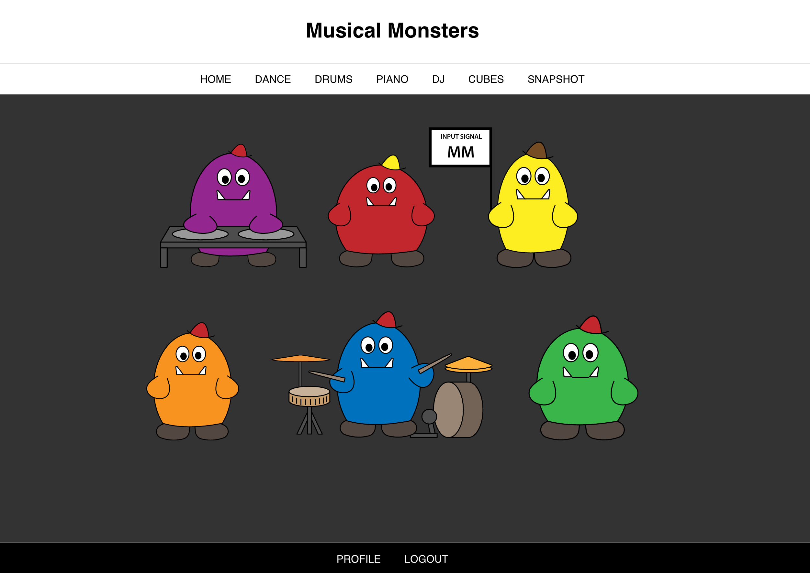

# Musical Monsters
Musical monsters is a fun and interactive web application that allows you to experiment with music!

## The Monsters
### 1. Dance Monster
Choose any music track from SoundCloud or Spotify and see Dance Monster dance along!

### 2. Cube Monsters
See 225 Cube Monsters bop along to music!

### 3. Drum Monster
Experiment with playing the hi-hat, snare drum, bass drum, and cymbal. Create your own beat, or play along to the demo track!

### 4. DJ Monster
Have fun creating your own sound experience from a selection of 6 tracks – enjoy mixing and fading using 2 digital decks!

### 5. Piano Monster
Piano Monster will help you become familiar with the keyboard, with 2 octaves of keys for you to try out your own compositions!

### 6. Snapshot Monster
For the inquisitive types, Snapshot Monster allows you to take an audio-snapshot of a demo track and inspect the input signal strength for 64 audio frequency ranges!

----
## Technical details

Musical Monsters is a Ruby on Rails web application (Ruby 2.3.0, Rails 4.2.6, Postgres 9.5.1).

Libraries / resources used:
- [Three.js](http://threejs.org)
- [D3.js](http://d3js.org)
- [Greensock TweenMax/TweenLite](https;//greensock.com)
- [Web Audio API](https://developer.mozilla.org/en-US/docs/Web/API/Web_Audio_API)
- [SoundCloud API](https://developer.soundcloud.com/)
- [Spotify API](https://developer.spotify.com/web-api/)

----
## Usage

Visit https://musical-monsters.herokuapp.com and try Musical Monsters now!

Alternatively, clone repo from https://github.com/danielmoi/musical-monsters, and then:
- Run `bundle` to install Ruby gems
- Run `rake db:migrate` and `rake db:seed` to populate database
- Run `rails server` and navigate to `http://localhost:3000`

----
## Support

Raise an issue here: https://github.com/danielmoi/musical-monsters/issues

Submit a pull request

Email me at daniel@ampersandmoi.com

----
Thanks for stopping by, and I hope you enjoy Musical Monsters!
